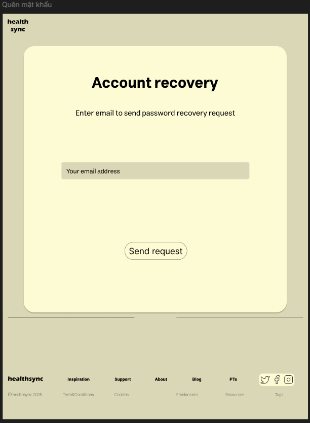
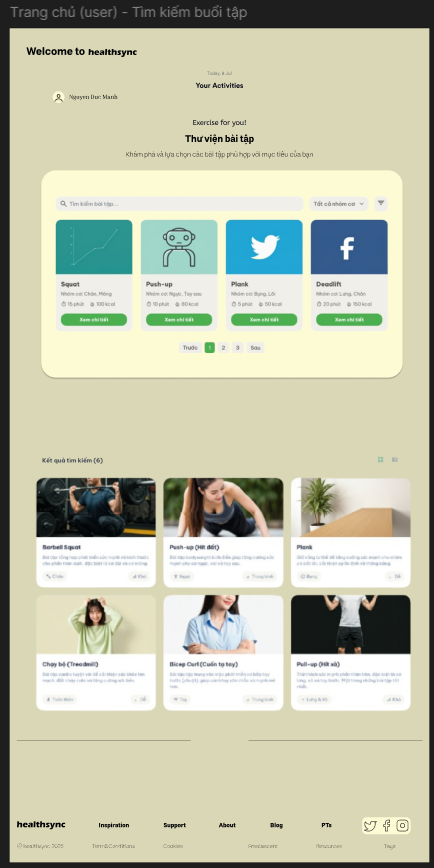
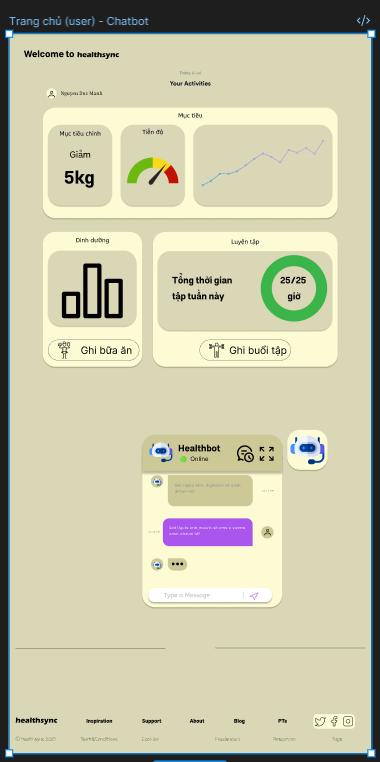
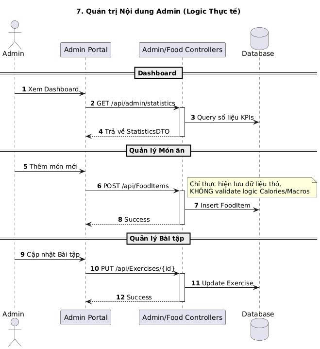
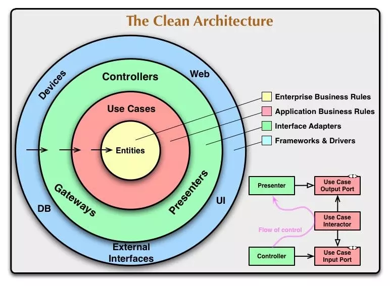
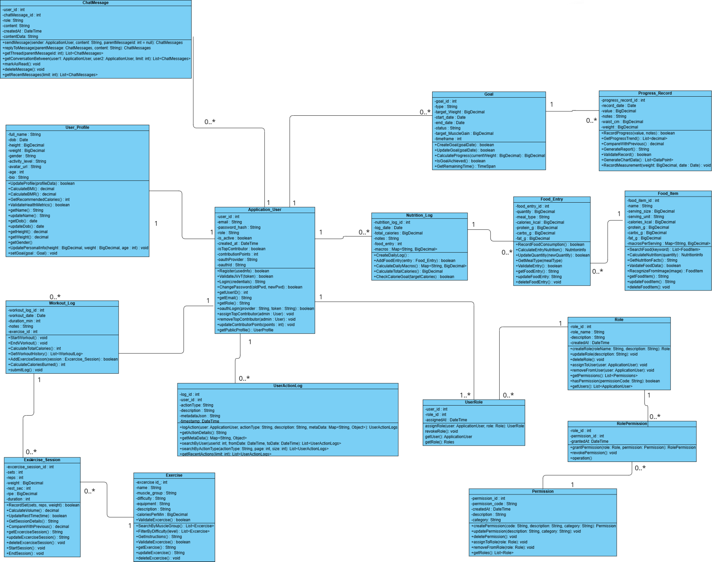

# 🚀 HealthSync - Hệ Thống Quản Lý Sức Khỏe & Luyện Tập Cá Nhân Đa Nền Tảng

[](https://dotnet.microsoft.com/)
[](https://react.dev/)
[](https://flutter.dev/)
[](https://www.docker.com/)
[](https://github.com/strawberrymilktea0604/HealthSync)
[](https://opensource.org/licenses/MIT)

---

## 🏫 Thông Tin Đồ Án
* **Trường:** Đại học Xây dựng Hà Nội (HUCE)
* **Khoa:** Công nghệ Thông tin - Bộ môn Khoa học Máy tính
* **Đề tài đồ án:** Chuyên đề tổng hợp - Nhóm 8
* **Giảng viên hướng dẫn:** TS. Hoàng Nam Thắng
* **Nhóm sinh viên thực hiện:**
  - Lã Minh Khánh - 4004267 - Lớp 67CS (Trưởng nhóm/Backend & DevOps)
  - Trịnh Quỳnh Anh - 0279367 - Lớp 67CS (Web Frontend)
  - Nguyễn Hải Cường - 0174067 - Lớp 67CS (Mobile Application)
  - Hoàng Quốc Vinh - 0312867 - Lớp 67CS (Database & Testing)
  - Nguyễn Xuân Hoàng - 0034267 - Lớp 67CS (AI Integration & Documents)

---

## 1. Header & Tóm Tắt Trực Quan (Abstract & Demo)

### 🎯 Đặt vấn đề & Ý tưởng cốt lõi
Trong nhịp sống hiện đại, tụi mình nhận thấy mọi người xung quanh (đặc biệt là dân văn phòng và sinh viên tụi mình) rất dễ rơi vào lối sống tĩnh tại, ít vận động và ăn uống thiếu khoa học. Mặc dù trên thị trường có nhiều app hỗ trợ sức khỏe, nhưng chúng thường bị rời rạc (app thì chỉ tính calo ăn, app thì chỉ đo bài tập) và thiếu tính cá nhân hóa. 

Vì vậy, nhóm 8 chúng em đã quyết định xây dựng **HealthSync** - một hệ sinh thái quản lý sức khỏe toàn diện đa nền tảng (Web, Mobile) tích hợp AI Chatbot. Dự án giúp kết nối mọi chỉ số cơ thể, nhật ký dinh dưỡng, lịch trình tập luyện của người dùng về một mối và đưa ra những lời khuyên thông minh, tức thời thông qua trợ lý AI.

### 📸 Giao diện Demo thực tế hệ thống
Để thầy cô và các bạn có cái nhìn trực quan nhất, đây là ảnh chụp màn hình giao diện Web Dashboard (phân tích chi tiết chỉ số) và Mobile App (sử dụng tiện lợi hàng ngày) mà nhóm em đã hoàn thiện:

| Web Dashboard (React + Tailwind CSS) | Mobile Application (Flutter App) |
|:---:|:---:|
|  |  |
| *Giao diện theo dõi calo, tiến độ mục tiêu dạng biểu đồ trên Web* | *Giao diện app di động trực quan, hiển thị nhanh chỉ số sức khỏe cơ thể* |

| Nhật Ký Dinh Dưỡng (Web) | Giao Diện Chatbot AI Tư Vấn (Mobile) |
|:---:|:---:|
|  |  |
| *Ghi chép bữa ăn chi tiết và tự động tính lượng calo nạp vào* | *Chatbot AI (Groq) phản hồi siêu tốc dưới 1 giây* |

---

## 2. Phương Pháp & Kiến Trúc Hệ Thống (System Design)

Nhóm em xác định ngay từ đầu là không làm một ứng dụng kiểu "mì ăn liền" gọi API thô sơ. Dự án này được thiết kế bài bản theo các chuẩn công nghiệp để có khả năng mở rộng (scalable) và dễ bảo trì (maintainable).

### 📐 Sơ đồ kiến trúc tổng thể (System Architecture)
Hệ thống sử dụng mô hình Client-Server với Nginx làm Reverse Proxy duy nhất tiếp nhận request từ bên ngoài, điều hướng cân bằng tải cho các service chạy Docker bên trong.



* **Client Layer:** Trình duyệt web (React SPA) và ứng dụng di động (Flutter) kết nối qua HTTPS/HTTP.
* **Reverse Proxy Layer:** Nginx điều phối traffic đến cụm server backend hoặc web frontend, xử lý SSL Termination và cấu hình Rate Limiting để bảo vệ hệ thống khỏi các đợt spam request.
* **Application Layer:** Backend API (.NET Core 8) được nhân bản chạy song song (2 replicas) giúp đảm bảo hệ thống không bị sập khi một container gặp sự cố.
* **Data & Storage Layer:** SQL Server 2022 lưu trữ dữ liệu nghiệp vụ quan hệ. MinIO Object Storage (tương thích AWS S3 API) quản lý toàn bộ hình ảnh, media (avatar, ảnh bài tập, món ăn) giúp hệ thống persistent hoàn toàn kể cả khi container bị restart.

---

### 📂 Kiến trúc Clean Architecture ở Backend
Để code không bị biến thành một "bãi rác" khi dự án phình to, nhóm em chia Backend thành 4 lớp độc lập theo quy tắc Dependency Inversion (luồng phụ thuộc chỉ hướng vào trong):

```
┌─────────────────────────────────────────────────────┐
│                 PRESENTATION LAYER                  │
│    (Controllers, Middleware, API Endpoints)         │
│                       │                             │
│                       ▼                             │
│                INFRASTRUCTURE LAYER                 │
│  (DbContext, Repositories, External Services)       │
│                       │                             │
│                       ▼                             │
│                 APPLICATION LAYER                   │
│    (Commands, Queries, Handlers, DTOs, Services)    │
│                       │                             │
│                       ▼                             │
│                   DOMAIN LAYER                      │
│       (Entities, Interfaces, Business Rules)        │
└─────────────────────────────────────────────────────┘
```

Chi tiết luồng hoạt động của Clean Architecture được minh họa cụ thể qua sơ đồ dưới đây:



1. **Domain Layer (Lõi):** Chứa các Entity (User, Profile, Goal, WorkoutLog, NutritionLog...) và các interface trừu tượng. Lớp này hoàn toàn sạch sẽ, không phụ thuộc vào bất kỳ thư viện ngoài nào (kể cả Entity Framework Core).
2. **Application Layer (Nghiệp vụ):** Áp dụng pattern **CQRS (Command Query Responsibility Segregation)** thông qua thư viện **MediatR**. Nhóm tách biệt hoàn toàn luồng ghi dữ liệu (Commands - ví dụ: `CreateGoalCommand`) và luồng đọc dữ liệu (Queries - ví dụ: `GetGoalsQuery`). Điều này giúp code cực kỳ tường minh và dễ viết Unit Test.
3. **Infrastructure Layer (Hạ tầng):** Triển khai các interface từ Domain/Application. Đây là nơi chứa `HealthSyncDbContext`, code kết nối cơ sở dữ liệu, dịch vụ lưu trữ MinIO và dịch vụ AI Chatbot.
4. **Presentation Layer (Giao diện API):** Chứa các Web API Controllers nhận request từ client, chuyển đổi dữ liệu thành các DTO và gửi qua MediatR để xử lý.

---

### 🗄️ Thiết kế Cơ sở dữ liệu & Sơ đồ lớp (Class Diagram)
Hệ thống sử dụng cơ sở dữ liệu quan hệ SQL Server. Để đảm bảo phân quyền chặt chẽ, nhóm em tự thiết kế hệ thống **RBAC (Role-Based Access Control)** bằng bảng ánh xạ nhiều-nhiều giữa User, Role và Permission thay vì dùng thư viện có sẵn để hiểu sâu hơn về luồng bảo mật. 

Bên cạnh đó, mọi thao tác quan trọng của người dùng đều được ghi lại thông qua bảng `UserActionLogs` (Audit Log) hoạt động như một Data Warehouse thu nhỏ.



---

### 🤖 Phân hệ Chatbot AI Tích hợp (Groq AI)
Điểm nhấn công nghệ của HealthSync là tích hợp trợ lý sức khỏe cá nhân thông minh. Thay vì chỉ gọi API hỏi đáp thông thường ( stateless ), nhóm em thiết kế cơ chế **Context Injection** cực kỳ chi tiết:


Khi người dùng gửi câu hỏi, hệ thống sẽ thực hiện luồng sau tại `ChatWithBotQueryHandler`:
1. **Thu thập chỉ số sinh trắc:** Lấy cân nặng, chiều cao, tính chỉ số BMI, BMR, TDEE hiện tại của người dùng.
2. **Lấy lịch sử hoạt động 7 ngày gần nhất:** Nhập thông tin tổng calo đã nạp từ bữa ăn và số phút tập luyện trong tuần qua.
3. **Đọc lịch sử thao tác hệ thống:** Lấy 20 thao tác gần nhất từ `UserActionLogs` (ví dụ: vừa xem bài tập Bench Press).
4. **System Awareness:** Đọc danh sách các bài tập và món ăn có sẵn trong DB để AI khuyên dùng đúng những gì hệ thống hỗ trợ.
5. **Gói thông tin vào System Prompt:** Tất cả thông tin trên được định dạng JSON và gán trực tiếp vào prompt hệ thống trước khi gửi đến API của **Groq AI** (Model `openai/gpt-oss-120b`).
6. **Nhận kết quả:** AI đưa ra câu trả lời cá nhân hóa hoàn hảo (Ví dụ: *"Mình thấy bạn vừa tập ngực hôm qua, hôm nay bạn nên tập chân để cơ bắp phục hồi. Dựa vào TDEE của bạn là 2200 kcal..."*) với tốc độ phản hồi siêu nhanh (< 1 giây).

---

## 3. Kết Quả Thực Nghiệm (Quantitative Results)

### 🧪 Chiến lược kiểm thử Backend tuyệt đối (99.7% Coverage)
Để đảm bảo dự án vận hành trơn tru và không bị lỗi vặt khi deploy, nhóm em đã dành rất nhiều thời gian viết test tự động. Chúng em xây dựng 5 project kiểm thử sử dụng **xUnit, FluentAssertions và Moq** bao gồm cả Unit Tests (cho Domain & Application) và Integration Tests (cho Presentation & Controllers sử dụng `WebApplicationFactory`).

Kết quả thực nghiệm đo đạc độ bao phủ mã nguồn (Code Coverage) đạt tỷ lệ gần như tuyệt đối:

| Thành phần kiểm thử | Số lượng Method | Lines Covered / Total | Tỷ lệ phần trăm | Trạng thái |
|:---|:---:|:---:|:---:|:---:|
| **Domain.Tests** | 22 | 195 / 195 | **100%** | ✅ Passed |
| **Application.Tests** | 98 | 912 / 914 | **99.78%** | ✅ Passed |
| **Infrastructure.Tests**| 35 | 320 / 322 | **99.37%** | ✅ Passed |
| **Presentation.Tests**  | 44 | 390 / 390 | **100%** | ✅ Passed |
| **Tổng backend API** | **199** | **1817 / 1821** | **99.7%** | ⭐ **Excellent** |

> 💡 *Nhờ viết test phủ kín 99.7% toàn bộ logic nghiệp vụ và API endpoint, nhóm em cực kỳ tự tin khi refactor code hay nâng cấp cơ sở dữ liệu mà không sợ làm sập các chức năng cũ.*

---

## 4. Khả Năng Tái Tạo & Triển Khai (Reproducibility & DevOps)

Nhóm em đã cấu hình sẵn toàn bộ môi trường chạy thực tế thông qua **Docker Compose**. Bạn không cần cài đặt SQL Server, MinIO hay Node.js thủ công trên máy local, chỉ cần thực hiện các bước sau:

### ⚙️ 1. Cài đặt biến môi trường
Sao chép tệp cấu hình mẫu `.env.example` thành `.env` ở thư mục gốc:
```bash
cp .env.example .env
```
Mở file `.env` ra và điền các thông tin của bạn. Điểm lưu ý chính:
* `GROQ_API_KEY`: API key của Groq AI để chạy chatbot.
* Các khóa bảo mật JWT, SMTP Email và Google OAuth (nếu muốn test đăng nhập bằng Google).

---

### 🐋 2. Khởi chạy toàn bộ hệ thống bằng Docker
Chạy lệnh duy nhất để build ứng dụng React, API .NET và tải các container DB, MinIO về:
```bash
docker-compose up -d --build
```
Kiểm tra trạng thái hoạt động của các container:
```bash
docker-compose ps
```
Hệ thống sẽ chạy các dịch vụ tại địa chỉ mặc định sau:
* **Ứng dụng Web (Frontend React):** [http://localhost:8080](http://localhost:8080) (Thông qua Nginx)
* **Backend Swagger API Document:** [http://localhost:8080/swagger](http://localhost:8080/swagger)
* **Trang quản trị MinIO Console:** [http://localhost:9003](http://localhost:9003) (User: `minioadmin` / Pass: `HealthSync@2025!`)

> 💡 *Khi container Backend API khởi động lần đầu, hệ thống sẽ tự động chạy lệnh Migration để tạo cấu trúc bảng trong SQL Server và Seed sẵn dữ liệu 50+ bài tập, món ăn mẫu vào cơ sở dữ liệu.*

---

### 📱 3. Chạy Mobile App (Flutter)
Để chạy app mobile, máy tính của bạn cần cài đặt Flutter SDK.
1. Di chuyển vào thư mục code di động:
   ```bash
   cd HealthSync_mobile
   ```
2. Cài đặt các thư viện dependency:
   ```bash
   flutter pub get
   ```
3. Chạy ứng dụng trên máy ảo Android hoặc iOS:
   ```bash
   flutter run
   ```

---

## 5. Cấu Trúc Thư Mục (Directory Structure)

Dưới đây là sơ đồ hình cây minh họa cách tổ chức source code dự án. Nhóm chia rõ ràng phân tách giữa backend, web frontend, mobile app, cấu hình server nginx và tài liệu đặc tả:

```
HealthSync/
├── backend/                             # Mã nguồn Backend API (.NET Core 8.0)
│   ├── HealthSync.Domain/               # Domain Layer (Thực thể & Giao diện)
│   │   ├── Entities/                    # Các bảng: ApplicationUser, Goal, NutritionLog...
│   │   └── Interfaces/                  # Khai báo các Repository & Service contract
│   ├── HealthSync.Application/          # Application Layer (Nghiệp vụ chính)
│   │   ├── Commands/                    # Logic thay đổi trạng thái (CQRS Command)
│   │   ├── Queries/                     # Logic lấy dữ liệu (CQRS Query)
│   │   └── Handlers/                    # Các Class xử lý Command & Query tương ứng
│   ├── HealthSync.Infrastructure/        # Infrastructure Layer (Hạ tầng kỹ thuật)
│   │   ├── Persistence/                 # DbContext, Repository implementation
│   │   └── Services/                    # Gọi API MinIO, Groq AI, SMTP Email
│   ├── HealthSync.Presentation/         # Presentation Layer (API Endpoints)
│   │   └── Controllers/                 # REST API tiếp nhận HTTP request
│   └── *Tests/                          # 5 dự án kiểm thử xUnit & Integration Tests
│
├── HealthSync_web/                      # Ứng dụng Web (React + TS + Vite)
│   ├── src/
│   │   ├── components/                  # UI components tái sử dụng
│   │   ├── pages/                       # Màn hình giao diện chính (Dashboard, Logs, Chat...)
│   │   └── services/                    # Axios client gọi API Backend
│   └── Dockerfile                       # Multi-stage build cho Web Frontend
│
├── HealthSync_mobile/                   # Ứng dụng di động (Cross-platform Flutter App)
│   ├── lib/
│   │   ├── screens/                     # Các màn hình di động
│   │   ├── providers/                   # Quản lý trạng thái ứng dụng (State)
│   │   └── services/                    # Lớp gọi kết nối API
│   └── pubspec.yaml                     # Quản lý thư viện phụ thuộc di động
│
├── nginx/                               # Cấu hình Web Server & Reverse Proxy
│   └── nginx.conf                       # Cấu hình Reverse proxy, Cache & Rate Limit
├── docs/                                # Tài liệu đặc tả đồ án
│   ├── images/                          # Hình ảnh sơ đồ và giao diện chụp thực tế
│   └── markdown/                        # Tài liệu chi tiết các phân hệ dạng Markdown
├── docker-compose.yml                   # Cấu hình Docker Orchestration toàn bộ dự án
└── .env.example                         # File biến môi trường mẫu
```

---

## 🛠️ 6. Tech Stack & Lời Cảm Ơn

### Công nghệ cốt lõi sử dụng
* **Tầng Backend:** C# (.NET Core 8.0), Entity Framework Core, MediatR, JWT Auth, FluentValidation.
* **Tầng Web Frontend:** TypeScript, React 18, Vite, Tailwind CSS, Shadcn UI, Recharts (vẽ biểu đồ).
* **Tầng Mobile App:** Dart, Flutter SDK, Provider (State management), FL Chart.
* **Môi trường & Cơ sở dữ liệu:** Docker, Docker Compose, Nginx, MS SQL Server 2022, MinIO Object Storage.
* **Dịch vụ AI:** Groq AI Cloud API (Model: `openai/gpt-oss-120b`).
* **Framework kiểm thử:** xUnit, Moq, FluentAssertions.

### 📚 Tài liệu tham khảo chính
1. *Clean Architecture: A Craftsman's Guide to Software Structure and Design* - Robert C. Martin.
2. *CQRS Pattern & MediatR library documentation in .NET Core*.
3. *Docker Compose & Multi-stage builds reference documentation*.
4. *Flutter Provider Pattern for State Management guide*.

### 💖 Lời cảm ơn chân thành
Chúng em xin gửi lời cảm ơn sâu sắc nhất tới **TS. Hoàng Nam Thắng** - giảng viên hướng dẫn trực tiếp đồ án này. Thầy đã không ngại dành những buổi chiều ròng rã định hướng cho nhóm em từ khâu thiết kế kiến trúc Clean Architecture, gợi ý áp dụng CQRS để tách biệt luồng code cho đến việc chỉ dạy tụi em viết Unit Test thế nào cho chuẩn. Những kiến thức thực tế và tư duy thiết kế hệ thống mà thầy truyền đạt chắc chắn sẽ là hành trang vô cùng quý giá cho chúng em trên con đường trở thành những kỹ sư phần mềm sau khi rời ghế nhà trường.

Chúng em cũng chân thành cảm ơn các thầy cô trong khoa Công nghệ Thông tin - Trường Đại học Xây dựng Hà Nội đã giảng dạy và hỗ trợ tài liệu suốt những năm học qua để nhóm em có đủ nền tảng hoàn thành đồ án này.

---
> **"Clean code always looks like it was written by someone who cares."** - *Robert C. Martin*
> 
> *HealthSync là đứa con tinh thần đầu tiên chứa đựng rất nhiều tâm huyết của nhóm 8 tụi mình. Cảm ơn các bạn đã ghé thăm repository!*