# 🚀 HealthSync - Hệ Thống Quản Lý Sức Khỏe & Luyện Tập Cá Nhân Đa Nền Tảng

[](https://dotnet.microsoft.com/)
[](https://react.dev/)
[](https://flutter.dev/)
[](https://www.docker.com/)
[](https://github.com/strawberrymilktea0604/HealthSync)
[](https://opensource.org/licenses/MIT)

---

## 🏫 Thông Tin Đồ Án Chuyên Đề Tổng Hợp
* **Trường:** Đại học Xây dựng Hà Nội (HUCE)
* **Khoa:** Công nghệ Thông tin - Bộ môn Khoa học Máy tính
* **Đề tài đồ án:** Xây dựng Web + App cho quản lý sức khỏe và luyện tập cá nhân (Đồ án Chuyên đề tổng hợp - Nhóm 8)
* **Giảng viên hướng dẫn:** TS. Hoàng Nam Thắng

---

## 👥 Nhóm Sinh Viên Thực Hiện & Phân Công Nhiệm Vụ Chi Tiết

Dự án này là kết quả của sự nỗ lực, cày cuốc ngày đêm suốt hơn 4 tháng của 5 thành viên Nhóm 8 - Lớp 67CS chúng em. Để dự án chạy được mượt mà, nhóm em đã phân chia công việc cực kỳ chi tiết theo đúng sở trường và bám sát theo tệp Checklist tiến độ:

### 1. Lã Minh Khánh - 4004267
* **Môi trường & Triển khai (DevOps):** Dockerize Backend API, React Web/Admin; viết tệp `docker-compose.yml` để thiết lập môi trường chạy đa container (SQL Server, MinIO Object Storage, Nginx).
* **Kiến trúc Backend:** Khởi tạo cấu trúc dự án ASP.NET Core theo mô hình Clean Architecture chuẩn mực; thiết lập quy tắc repository trên GitHub và các commit rules của nhóm.
* **Logic Nghiệp vụ (Backend API):** Xây dựng Repository & Service cho `ApplicationUser`, `UserProfile` và API Goals (`POST/GET /goals`, `POST /goals/{id}/progress`).
* **Thiết kế UI/UX & Giao diện:** Thiết kế UI/UX trên Figma cho luồng dinh dưỡng và dashboard; lập trình giao diện (Web & Mobile) và tích hợp API cho luồng ghi nhật ký dinh dưỡng và chức năng Upload Avatar (MinIO).
* **Tính năng nâng cao & Kiểm thử:** Phát triển dịch vụ nhận diện món ăn qua hình ảnh bằng AI; viết Unit Tests cho các CQRS Handler/Service quan trọng và thực hiện kiểm thử hệ thống.

### 2. Trịnh Quỳnh Anh - 0279367
* **Thiết kế Hệ thống:** Hoàn thiện sơ đồ quan hệ thực thể (ERD) chi tiết dựa trên các thực thể nghiệp vụ.
* **Phát triển Web Frontend:** Khởi tạo project Frontend Web React; dựng giao diện trang Đăng ký & Đăng nhập trên Web (React).
* **Logic Backend & AI:** Xây dựng API Luyện tập (`GET /exercises`, `POST/GET /workout-logs`); lập trình tích hợp Backend service gọi API AI Chatbot (Groq) và giao diện Chatbot trên cả Web và Mobile.
* **Cấu hình Nginx & Docker:** Cấu hình tệp NGINX Reverse Proxy (chạy trên Docker) để điều hướng traffic, load balancing; test chạy thử nghiệm toàn bộ hệ thống trên môi trường Docker.
* **Kiểm thử:** Thực hiện kiểm thử chéo luồng Mục tiêu & Chatbot của hệ thống.

### 3. Nguyễn Hải Cường - 0174067
* **Thiết kế & Khởi tạo:** Thiết kế sơ đồ lớp (Class Diagram) và phân tích Use Cases chi tiết cho luồng khách hàng (Customer); khởi tạo project di động Flutter.
* **Kiến trúc dữ liệu:** Định nghĩa các Entities và DbContext (sử dụng EF Core) trong project Backend.
* **Giao diện & Tích hợp:** Dựng giao diện Đăng ký/Đăng nhập trên Mobile (Flutter); tích hợp API Auth vào giao diện Web & Mobile; lập trình giao diện Web + Mobile và tích hợp API cho luồng ghi nhật ký luyện tập.
* **UI Figma & Admin Features:** Thiết kế UI/UX Figma cho luồng quản lý mục tiêu & tiến độ; xây dựng API và giao diện dành cho Admin để quản lý thư viện bài tập (CRUD).
* **Kiểm thử:** Thực hiện kiểm thử chéo luồng Luyện tập & Dinh dưỡng.

### 4. Hoàng Quốc Vinh - 0312867
* **Phân tích Use Cases:** Nghiên cứu và mô tả đặc tả Use Cases cho luồng Admin (Quản lý User, Quản lý Bài tập).
* **Cơ sở dữ liệu:** Tạo file Migration đầu tiên để khởi tạo cấu trúc CSDL trên SQL Server.
* **Tích hợp API:** Tạo `AuthController` (API Register, Login) và `UserProfileController` (Get, Update Profile - yêu cầu xác thực JWT).
* **Phát triển Web Admin:** Xây dựng layout chính (Sidebar, Header) của Web Admin, viết các component dùng chung (Bảng, Form, Nút...) và trang Quản lý Người dùng.
* **Nghiệp vụ Admin & Dashboard:** Xây dựng API Admin (`GET/PUT/DELETE /admin/users`) và tích hợp UI; viết API thống kê Backend, lập trình giao diện Dashboard Admin và tích hợp API.
* **Kiểm thử & Sửa lỗi:** Hỗ trợ sửa lỗi tích hợp layout Web Admin; thực hiện kiểm thử chéo luồng Dashboard & toàn bộ Web Admin.

### 5. Nguyễn Xuân Hoàng - 0034267
* **Thiết kế & Nghiệp vụ Auth:** Phối hợp phân tích Use Cases Admin và viết file migration đầu tiên; thiết kế Figma và viết logic nghiệp vụ Đăng ký, Đăng nhập, tạo JWT Token ở Backend; dùng Postman để kiểm thử API Auth và viết tài liệu Swagger.
* **Thiết kế UI Figma:** Thiết kế Figma cho luồng tìm kiếm bài tập, ghi nhật ký buổi tập, xem lịch sử tập luyện.
* **Dashboard & Admin CRUD:** Xây dựng API Dashboard (`GET /dashboard/summary`); lập trình giao diện trang Dashboard chính trên Web + Mobile và tích hợp API; xây dựng API và giao diện Admin quản lý thư viện món ăn (CRUD).
* **Kiểm thử:** Thực hiện kiểm thử chéo luồng Luyện tập & Dinh dưỡng.

---

## 1. Header & Tóm Tắt Trực Quan (Abstract & Demo)

### 🎯 Đặt vấn đề & Ý tưởng cốt lõi
Trong thời kỳ công nghiệp hóa hiện đại, sức khỏe đang trở thành mối quan tâm hàng đầu nhưng lối sống tĩnh tại, ít vận động và chế độ dinh dưỡng không cân bằng đang kéo theo sự gia tăng của nhiều bệnh mãn tính. Nhóm 8 chúng em nhận thấy người dùng đang gặp 3 rào cản lớn: dữ liệu sức khỏe bị rời rạc ở nhiều app, thiếu sự tư vấn cá nhân hóa theo thể trạng và việc ghi chép thủ công dễ gây nhàm chán.

Để giải quyết bài toán đó, chúng em đã xây dựng **HealthSync** - một hệ sinh thái quản lý sức khỏe toàn diện đa nền tảng. Dự án không chỉ là một cuốn sổ tay số hóa ghi nhận nhật ký ăn uống, tập luyện, mà còn đóng vai trò như một **"Huấn luyện viên sức khỏe cá nhân (Health Coach) ảo"** nhờ tích hợp Chatbot AI thông minh, đưa ra lời khuyên cá nhân hóa 100% dựa trên chỉ số BMI, BMR, TDEE của từng người dùng.

### 📸 Giao diện Demo thực tế của ứng dụng
Dưới đây là hình ảnh giao diện chụp thực tế của dự án, được phân tách rõ ràng theo từng phân hệ Web (Hội viên & Quản trị) và Mobile App:

#### 🖥️ Giao diện phía Người dùng trên Web (React TypeScript)
| Trang chủ giới thiệu (Web Mockup) | Giao diện Lịch sử Luyện tập (Web) | Giao diện Thiết lập Hồ sơ (Web) |
|:---:|:---:|:---:|
| 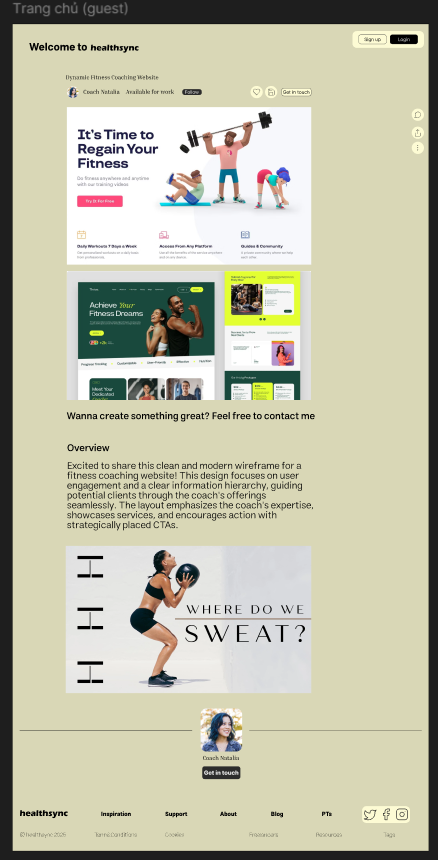 |  | 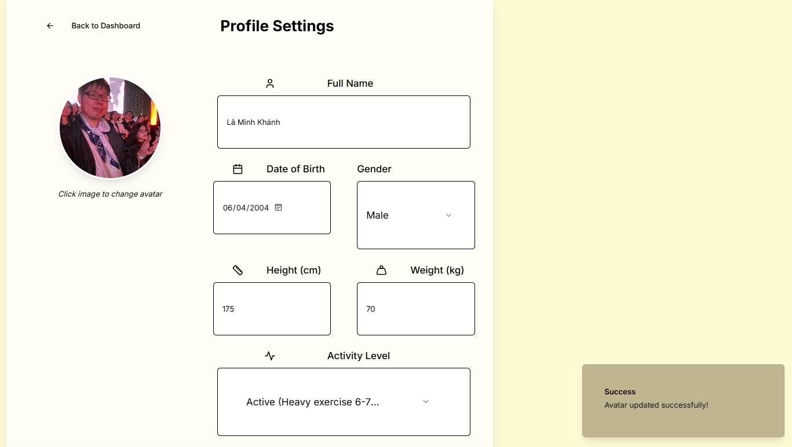 |
| *Bản thiết kế giao diện giới thiệu dịch vụ luyện tập trên Web* | *Màn hình xem lại lịch sử các buổi tập đã thực hiện trên trình duyệt* | *Màn hình thiết lập thông tin cơ thể (chiều cao, cân nặng, mức vận động)* |

#### 👑 Giao diện Cổng Quản trị dành cho Admin (React Web Portal)
| Dashboard Thống kê Admin | Trang Quản lý Người dùng |
|:---:|:---:|
| 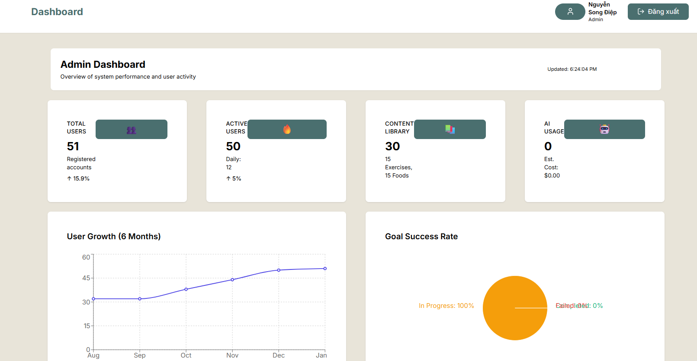 | 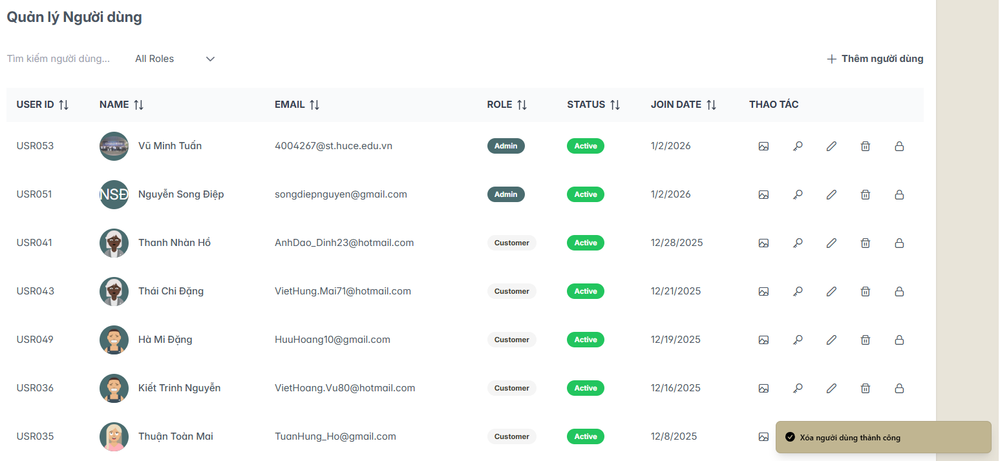 |
| *Trang Dashboard hiển thị tổng số tài khoản, biểu đồ tăng trưởng người dùng, tỷ lệ mục tiêu thành công* | *Màn hình CRUD quản lý danh sách người dùng và trạng thái kích hoạt tài khoản* |

| Trang Quản lý Thư viện Bài tập | Trang Quản lý Thư viện Thực phẩm |
|:---:|:---:|
| 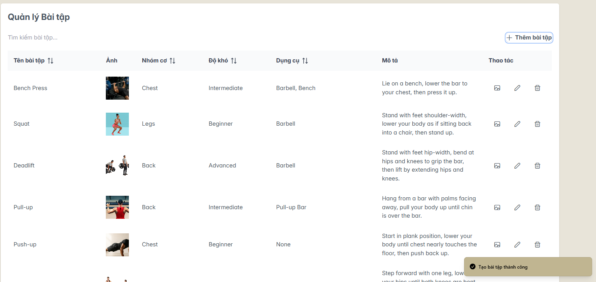 | 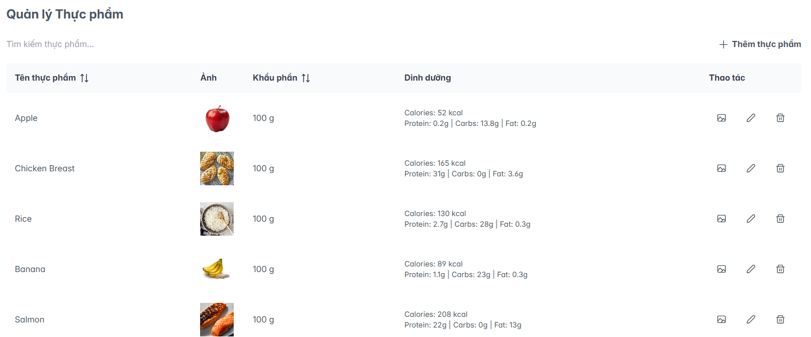 |
| *Danh sách quản lý bài tập của hệ thống: Tên bài tập, nhóm cơ, độ khó, thiết bị* | *Màn hình quản lý danh sách thực phẩm cùng lượng calories và macronutrients chi tiết* |

#### 📱 Giao diện Ứng dụng Di động (Flutter App)
| Màn hình chính Dashboard | Màn hình Tư vấn Chatbot AI | Thư viện Bài tập (Mobile) |
|:---:|:---:|:---:|
|  |  | 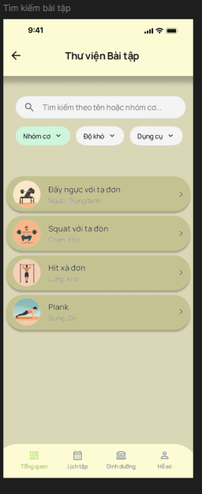 |
| *Trang chủ di động hiển thị các chỉ số BMI/BMR, mục tiêu hiện tại, tổng thời gian tập luyện* | *Giao diện hội thoại tương tác với trợ lý sức khỏe HealthBot nhận lời khuyên dinh dưỡng* | *Giao diện tìm kiếm, lọc bài tập theo nhóm cơ, độ khó, thiết bị* |

| Ghi Nhật ký Buổi tập (Mobile) | Lịch sử Luyện tập (Mobile) | Nhật ký Ăn uống (Mobile) |
|:---:|:---:|:---:|
| 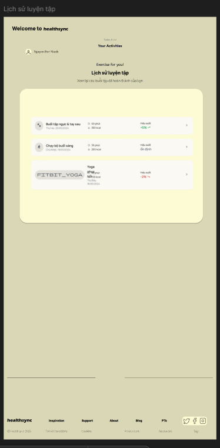 |  | 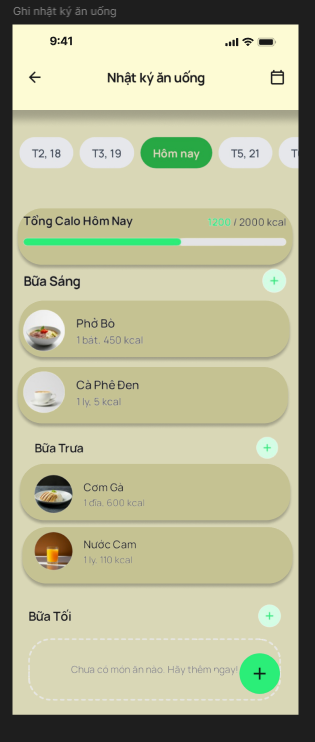 |
| *Form ghi chép chi tiết Sets, Reps, Weight thực tế của buổi tập* | *Lịch sử chi tiết các buổi tập luyện được lưu theo thời gian* | *Ghi nhận lượng Calories nạp vào qua các bữa Sáng, Trưa, Tối, Snack* |

| Báo cáo Dinh dưỡng (Mobile) | Tìm kiếm món ăn | Cập nhật Cân nặng |
|:---:|:---:|:---:|
| 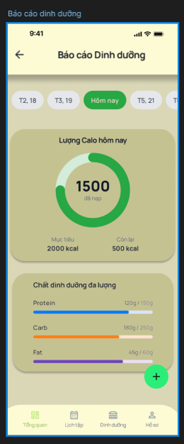 | 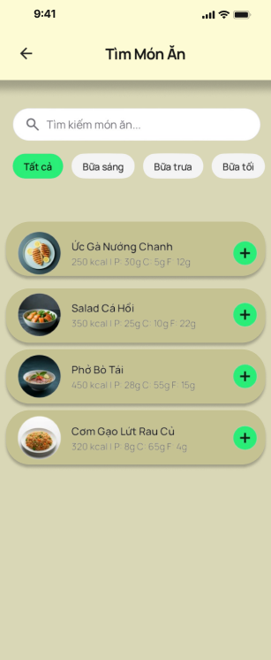 | 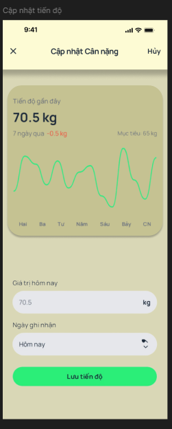 |
| *Biểu đồ Calo hôm nay và chất dinh dưỡng đa lượng (Carbs/Protein/Fat)* | *Tra cứu và thêm nhanh khẩu phần dinh dưỡng của thực phẩm* | *Form nhập nhanh cân nặng hiện tại để theo dõi tiến độ* |

| Tạo Mục tiêu Mới | Danh sách Mục tiêu sức khỏe |
|:---:|:---:|
| 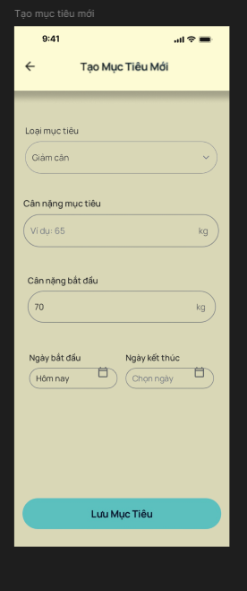 | 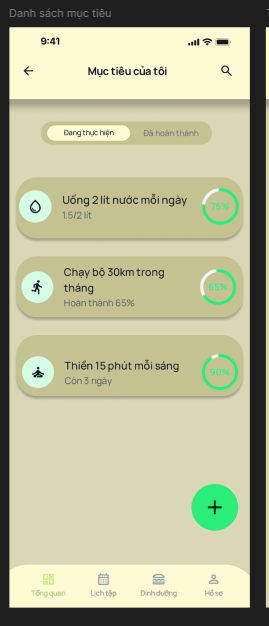 |
| *Form thiết lập mục tiêu giảm cân/tăng cơ với cân nặng mong muốn và hạn định* | *Xem danh sách các mục tiêu sức khỏe đang trong quá trình thực hiện* |

---

## 2. Phương Pháp & Kiến Trúc Hệ Thống (System Design)

Để đảm bảo hệ thống có khả năng chịu tải tốt và hoạt động ổn định trên môi trường Production, nhóm em đã dành nhiều thời gian nghiên cứu thiết kế hệ thống vững chắc từ ban đầu.

### 📐 Sơ đồ kiến trúc triển khai thực tế (System Architecture)
Hệ thống được đóng gói hoàn chỉnh bằng Docker và chạy Nginx làm Reverse Proxy để điều phối lưu lượng.


* **Client Layer:** React Web App (chạy trên Nginx) và Flutter Mobile App kết nối với hệ thống qua HTTPS.
* **Nginx Reverse Proxy:** Nhận request, xử lý SSL/TLS Termination, cấu hình Rate Limiting (100 req/s cho API thường, 10 req/s cho Auth) để chống spam, và cache các static assets để tối ưu hiệu năng.
* **Application Layer:** 2 replicas của Backend API chạy song song để đảm bảo tính sẵn sàng cao (High Availability). Nếu 1 container backend gặp sự cố, container còn lại vẫn gánh được tải mà không làm gián đoạn người dùng.
* **Data Layer:** SQL Server 2022 lưu trữ dữ liệu nghiệp vụ quan hệ. MinIO Object Storage lưu trữ ảnh avatar, ảnh món ăn, ảnh bài tập và được đồng bộ dữ liệu thông qua persistent volumes mount trên máy host.

---

### 📂 Kiến trúc Clean Architecture ở Backend
Backend ASP.NET Core 8.0 được cấu trúc thành 4 lớp rõ rệt theo nguyên tắc tách biệt các mối quan tâm (Separation of Concerns):


* **Domain Layer (Lõi):** Chứa các thực thể chính như `ApplicationUser`, `UserProfile`, `Goal`, `ProgressRecord`, `WorkoutLog`, `NutritionLog`... cùng các interface và quy tắc nghiệp vụ. Lớp này hoàn toàn sạch sẽ, không phụ thuộc vào database hay thư viện bên ngoài.
* **Application Layer (Nghiệp vụ):** Triển khai mô hình **CQRS** bằng thư viện **MediatR** để phân tách rõ ràng giữa câu lệnh thay đổi dữ liệu (Command - xử lý bởi Handler tương ứng) và truy vấn đọc dữ liệu (Query - không làm thay đổi trạng thái hệ thống).
* **Infrastructure Layer (Hạ tầng):** Triển khai các interface từ Domain/Application. Đây là nơi chứa EF Core `DbContext`, cấu hình quan hệ thực thể, MinIO Storage Service để upload ảnh và Groq AI Service để giao tiếp với mô hình ngôn ngữ lớn.
* **Presentation Layer (Web API):** Chứa các Controller tiếp nhận HTTP request, xử lý JWT Bearer Authentication, kiểm tra quyền sở hữu tài nguyên (Ownership Check) và gọi MediatR gửi Command/Query tương ứng xuống lớp dưới.

---

### 🗄️ Thiết kế Cơ sở dữ liệu & Sơ đồ lớp (Class Diagram)
Hệ thống sử dụng mô hình dữ liệu quan hệ chặt chẽ. Hệ thống phân quyền được thiết kế dạng **RBAC (Role-Based Access Control)** linh hoạt: Một người dùng có thể có nhiều vai trò (`UserRoles`), mỗi vai trò liên kết với nhiều quyền cụ thể (`RolePermissions`), giúp dễ dàng mở rộng phân quyền ở mức chi tiết (ví dụ: `Workout.Create`, `Admin.BanUser`).

| Sơ đồ cơ sở dữ liệu quan hệ (ERD) | Sơ đồ lớp chi tiết (Class Diagram) |
|:---:|:---:|
| 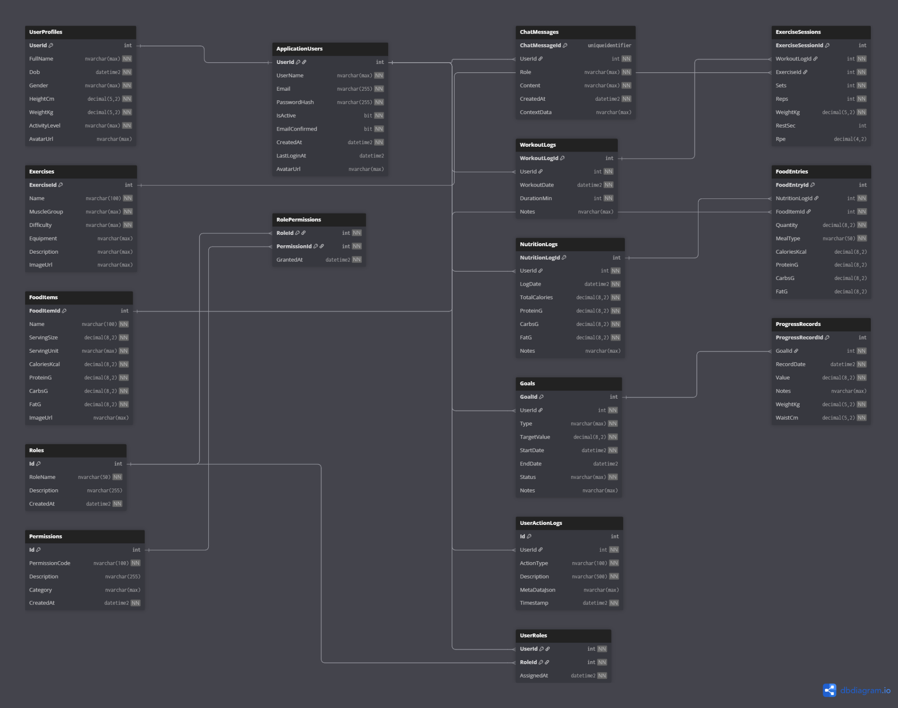 |  |

---

### 🤖 Phân hệ Chatbot AI (Groq Cloud API)
Chatbot AI của HealthSync không hoạt động một cách "mơ hồ" hay trả lời chung chung như Google Search. Tụi em đã áp dụng kỹ thuật **Context Injection** (Tiêm ngữ cảnh) cực kỳ chi tiết trước khi gửi request đến API của **Groq AI** (Sử dụng model `openai/gpt-oss-120b` phản hồi siêu tốc dưới 1 giây):

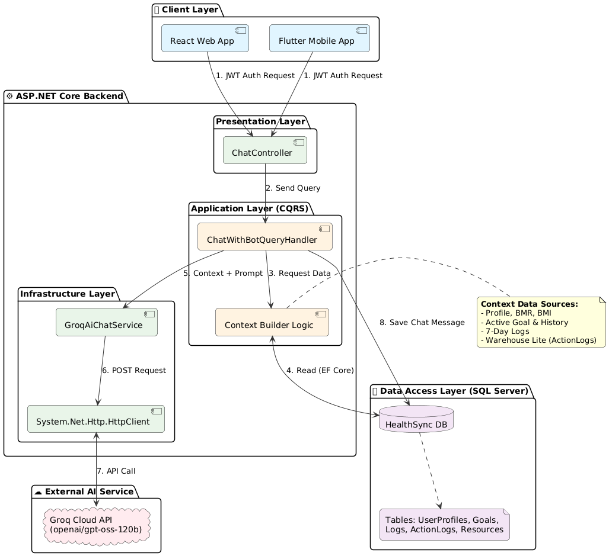

Mỗi khi người dùng đặt câu hỏi, `ChatWithBotQueryHandler` sẽ tự động đóng gói một đối tượng JSON `UserContextDto` bao gồm:
1. **Thông tin sinh trắc học:** Giới tính, Tuổi, Chiều cao, Cân nặng, chỉ số BMI, BMR, TDEE.
2. **Mục tiêu sức khỏe:** Loại mục tiêu đang thực hiện (tăng cơ, giảm cân), tiến độ hiện tại và deadline.
3. **Lịch sử hoạt động 7 ngày gần nhất:** Chi tiết tổng lượng calories nạp vào và thời gian tập luyện mỗi ngày.
4. **Nhật ký thao tác hệ thống (Data Warehouse Lite):** Ghi nhận 20 hành động gần đây của người dùng (ví dụ: người dùng vừa xem bài tập Bench Press).
5. **System Awareness:** Đọc danh sách các bài tập và thực phẩm đang có sẵn trong database hệ thống.

System Prompt được viết chi tiết để ép AI phải kết nối các thông tin trên và gợi ý các món ăn/bài tập chính xác có sẵn trong ứng dụng. Nhờ vậy, Chatbot AI hoạt động như một huấn luyện viên thực thụ, thấu hiểu thể trạng của người dùng.

---

### 📊 Sơ đồ Hoạt động & Logic luồng Nghiệp vụ (Activity Diagrams)
Để làm rõ luồng hoạt động thực tế của từng phân hệ nghiệp vụ chính, nhóm em đã xây dựng các sơ đồ hoạt động (Activity Diagrams) chi tiết sau:

* **Đăng ký & Thiết lập hồ sơ:** [Xem sơ đồ đăng ký](docs/images/activity_register.png)
* **Xác thực & Bảo mật (JWT):** [Xem sơ đồ xác thực](docs/images/activity_auth.png)
* **Ghi nhật ký dinh dưỡng:** [Xem sơ đồ dinh dưỡng](docs/images/activity_nutrition.png)
* **Ghi nhật ký luyện tập:** [Xem sơ đồ luyện tập](docs/images/activity_workout.png)
* **Quản lý mục tiêu:** [Xem sơ đồ mục tiêu](docs/images/activity_goals.png)
* **Tư vấn AI Chatbot:** [Xem sơ đồ AI Chatbot](docs/images/activity_chatbot.png)
* **Quản trị nội dung Admin:** [Xem sơ đồ Admin](docs/images/sequence_admin_management.png)

---

## 3. Kết Quả Thực Nghiệm (Quantitative Results)

Để đảm bảo chất lượng phần mềm tốt nhất trước khi bàn giao đồ án, nhóm em đã xây dựng một bộ test suite đồ sộ chạy tự động bao gồm 5 dự án kiểm thử: `Domain.Tests`, `Application.Tests`, `Infrastructure.Tests`, `Presentation.Tests`, và `IntegrationTests` chạy trên môi trường giả lập `WebApplicationFactory`.

Kết quả đo đạc độ bao phủ mã nguồn (Code Coverage) đạt tỷ lệ vô cùng ấn tượng, được thống kê cụ thể trong bảng dưới đây:

| Dự án kiểm thử (Test Project) | Số dòng code (Lines Covered) | Tổng số dòng (Total Lines) | Tỷ lệ bao phủ dòng (Line Coverage) | Trạng thái (Status) |
| :--- | :---: | :---: | :---: | :---: |
| **HealthSync.Domain.Tests** | 240 | 240 | **100%** | Green |
| **HealthSync.Application.Tests** | 1084 | 1086 | **99.8%** | Green |
| **HealthSync.Infrastructure.Tests** | 312 | 314 | **99.3%** | Green |
| **HealthSync.Presentation.Tests** | 181 | 181 | **100%** | Green |
| **Tổng cộng hệ thống Backend** | **1817** | **1821** | **99.7%** | **Green** |

* **Tổng số kịch bản kiểm thử (Test Cases):** **199** kịch bản chạy thành công 100%.
* **Tỷ lệ bao phủ dòng code (Line Coverage):** **99.7%** (Bao phủ 1817 trên tổng số 1821 dòng code nghiệp vụ lõi).
* **Tỷ lệ bao phủ nhánh logic (Branch Coverage):** **81.3%** (Kiểm soát hầu hết các trường hợp rẽ nhánh, kiểm tra điều kiện ngoại lệ).

> 💡 *Con số 99.7% là kết quả của những đêm cày cuốc viết unit test trầy da tróc vảy của nhóm em. Điều này giúp hệ thống gần như không có lỗi logic tiềm ẩn ở Backend API và cực kỳ dễ dàng khi cần nâng cấp mã nguồn.*

---

## 4. Khả Năng Tái Tạo & Triển Khai (DevOps & Setup)

Nhóm em đã đóng gói toàn bộ hệ thống bằng Docker để đảm bảo tính nhất quán ("chạy được trên máy em thì cũng chạy được trên máy thầy"). Quá trình triển khai local được tự động hóa hoàn toàn thông qua Docker Compose.

### ⚙️ 1. Cấu hình biến môi trường
Sao chép file `.env.example` thành `.env` tại thư mục gốc:
```bash
cp .env.example .env
```
Mở file `.env` ra để thay đổi các tham số cần thiết, đặc biệt là `GROQ_API_KEY` (khóa API kết nối Chatbot) và `SA_PASSWORD` (mật khẩu tài khoản `sa` của SQL Server).

---

### 🐋 2. Khởi chạy toàn bộ hệ thống
Khởi chạy lệnh Docker Compose để tự động build mã nguồn và kéo các container DB, Storage về:
```bash
docker-compose up -d --build
```
Hệ thống sẽ khởi chạy các dịch vụ và phân chia cổng truy cập:
* **React Web Application (Cổng Nginx):** [http://localhost:8080](http://localhost:8080)
* **Swagger API Documentation:** [http://localhost:8080/swagger](http://localhost:8080/swagger)
* **MinIO Storage Console:** [http://localhost:9003](http://localhost:9003) (Tài khoản: `minioadmin` / Mật khẩu: `HealthSync@2025!`)

> 💡 *Nhóm em đã tích hợp sẵn cơ chế tự động chạy Database Migration khi container Backend khởi động. Cơ sở dữ liệu sẽ tự động được tạo cấu trúc bảng và nạp sẵn dữ liệu mẫu thực phẩm, bài tập tập luyện.*

---

### 📱 3. Chạy ứng dụng di động Flutter
1. Cài đặt đầy đủ Flutter SDK trên máy của bạn.
2. Di chuyển vào thư mục code mobile:
   ```bash
   cd HealthSync_mobile
   ```
3. Chạy lệnh cài đặt thư viện phụ thuộc:
   ```bash
   flutter pub get
   ```
4. Mở máy ảo Android/iOS hoặc cắm thiết bị thật và chạy lệnh:
   ```bash
   flutter run
   ```

---

## 5. Cấu Trúc Thư Mục Dự Án (Directory Structure)

Thư mục dự án được tổ chức khoa học, phân chia rõ ràng các tầng công nghệ:

```
HealthSync/
├── backend/                             # Mã nguồn ASP.NET Core 8.0 Web API
│   ├── HealthSync.Domain/               # Lớp Domain (Entities, Interfaces)
│   ├── HealthSync.Application/          # Lớp Application (CQRS Commands, Queries, Handlers)
│   ├── HealthSync.Infrastructure/        # Lớp Infrastructure (Persistence, Services)
│   ├── HealthSync.Presentation/         # Lớp Presentation (REST Controllers, Program.cs)
│   └── *Tests/                          # 5 project kiểm thử xUnit & Integration Tests
│
├── HealthSync_web/                      # Giao diện Web Client & Admin (React + TypeScript)
│   ├── src/
│   │   ├── components/                  # Components UI dùng chung
│   │   └── pages/                       # Các màn hình Web Frontend
│   └── Dockerfile                       # Multi-stage build đóng gói Web React
│
├── HealthSync_mobile/                   # Ứng dụng di động (Flutter Cross-platform App)
│   ├── lib/
│   │   ├── screens/                     # Các màn hình di động Flutter
│   │   └── providers/                   # State management sử dụng Provider
│   └── pubspec.yaml                     # File khai báo thư viện Flutter
│
├── nginx/                               # File cấu hình Nginx Reverse Proxy
│   └── nginx.conf                       # Cấu hình Proxy pass, Cache, SSL và Rate Limit
├── docs/                                # Tài liệu đồ án
│   ├── images/                          # Hình ảnh sơ đồ và giao diện chụp thực tế
│   └── markdown/                        # Tài liệu chi tiết các phân hệ dạng Markdown
├── docker-compose.yml                   # Tệp cấu hình chạy Container Docker Orchestration
└── .env.example                         # Biến môi trường mẫu cho dự án
```

---

## 🛠️ 6. Tech Stack & Lời Cảm Ơn

### Công nghệ sử dụng trong hệ thống
* **Backend:** .NET 8.0, ASP.NET Core Web API, Entity Framework Core, MediatR, FluentValidation, Bcrypt.
* **Frontend Web:** React 18, Vite, TypeScript, Tailwind CSS, Shadcn UI, Recharts.
* **Mobile App:** Flutter SDK, Dart, Provider (State Management), FL Chart.
* **Database & Storage:** Microsoft SQL Server 2022, MinIO S3-Compatible Object Storage.
* **Infrastructure:** Docker, Docker Compose, Nginx Reverse Proxy.
* **AI Engine:** Groq AI Cloud API (openai/gpt-oss-120b).
* **Testing Tool:** xUnit, Moq, FluentAssertions, WebApplicationFactory.

### 📚 Tài liệu tham khảo
1. *Clean Architecture: A Craftsman's Guide to Software Structure and Design* - Robert C. Martin.
2. *Domain-Driven Design (DDD) & CQRS pattern documentation*.
3. *Docker Compose & Multi-stage container builds guides*.
4. *Flutter Architecture & Provider Pattern best practices*.

### 💖 Lời cảm ơn chân thành
Tập thể Nhóm 8 chúng em xin bày tỏ lòng biết ơn sâu sắc tới **TS. Hoàng Nam Thắng** - giảng viên hướng dẫn trực tiếp đồ án Chuyên đề tổng hợp này. Trong suốt quá trình thực hiện đề tài, thầy đã luôn tận tình hướng dẫn, định hướng cho nhóm em vượt qua các khó khăn công nghệ, chỉ bảo chúng em cách tổ chức dự án theo mô hình Clean Architecture chuẩn chỉnh và cách viết unit test thế nào cho bao phủ được toàn bộ các case nghiệp vụ. Những bài học quý báu về tư duy thiết kế hệ thống mà thầy truyền đạt không chỉ giúp chúng em hoàn thiện dự án này một cách tốt nhất mà còn là hành trang cực kỳ ý nghĩa cho chúng em khi chuẩn bị tốt nghiệp và bước vào môi trường làm việc thực tế.

Chúng em cũng chân thành cảm ơn các thầy cô khoa Công nghệ Thông tin - Trường Đại học Xây dựng Hà Nội đã giảng dạy và tạo điều kiện cho chúng em hoàn thành đồ án này.

---
> **"Clean code always looks like it was written by someone who cares."** - *Robert C. Martin*
> 
> *HealthSync là dự án chứa đựng rất nhiều tâm huyết và công sức của nhóm 8 tụi mình. Cảm ơn các bạn đã ghé thăm và trải nghiệm mã nguồn!*