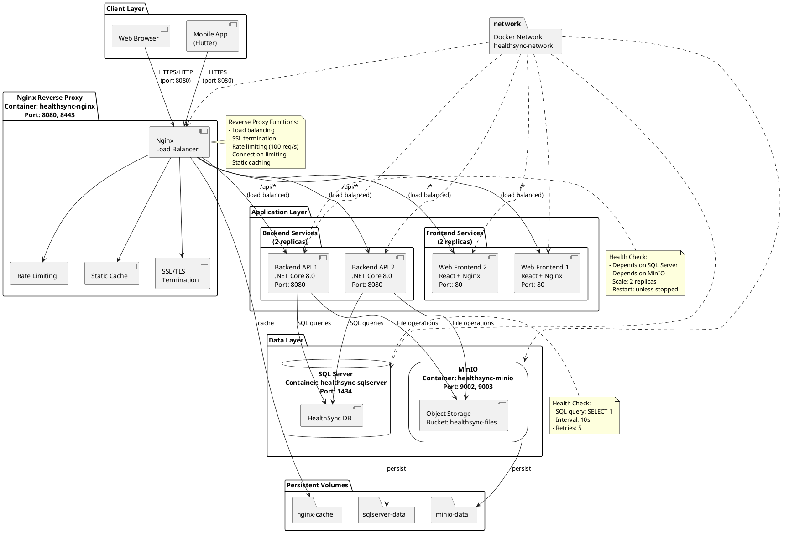

# CHƯƠNG VIII: TRIỂN KHAI HỆ THỐNG

## 8.1. Tổng quan kiến trúc triển khai

Hệ thống HealthSync được triển khai theo kiến trúc microservices sử dụng Docker container và Docker Compose để quản lý các thành phần. Kiến trúc triển khai bao gồm các tầng chính: tầng ứng dụng người dùng (Web và Mobile), tầng reverse proxy, tầng backend API, và tầng dữ liệu.

### 8.1.1. Các thành phần chính

Hệ thống bao gồm các thành phần sau:

- **Frontend Web**: Ứng dụng web được xây dựng bằng React, đóng gói trong Nginx container
- **Mobile Application**: Ứng dụng di động được phát triển bằng Flutter, hỗ trợ Android và iOS
- **Backend API**: RESTful API được phát triển bằng ASP.NET Core 8.0
- **Nginx Reverse Proxy**: Điều phối traffic và cân bằng tải
- **SQL Server**: Cơ sở dữ liệu quan hệ lưu trữ dữ liệu nghiệp vụ
- **MinIO**: Object storage để lưu trữ files và media

### 8.1.2. Chiến lược triển khai

Hệ thống áp dụng chiến lược containerization với Docker để đảm bảo tính nhất quán giữa các môi trường phát triển, kiểm thử và production. Các container được điều phối thông qua Docker Compose với khả năng scale horizontal cho các service backend và frontend web.

## 8.2. Sơ đồ kiến trúc triển khai

### 8.2.1. Đặc tả sơ đồ hệ thống

Sơ đồ triển khai mô tả cách các thành phần của hệ thống được tổ chức và giao tiếp với nhau trong môi trường production:

**Tầng người dùng (Client Layer)**:
- Web Browser: Truy cập ứng dụng web qua HTTP/HTTPS thông qua port 8080
- Mobile App: Ứng dụng Flutter trên Android/iOS kết nối API qua HTTPS

**Tầng Reverse Proxy**:
- Nginx container đóng vai trò điểm vào duy nhất của hệ thống
- Thực hiện load balancing cho backend và frontend
- Xử lý SSL/TLS termination
- Cấu hình rate limiting và connection limiting để bảo vệ hệ thống
- Cache static assets để tối ưu hiệu năng

**Tầng ứng dụng (Application Layer)**:
- Backend API: 2 replicas chạy song song để đảm bảo high availability
- Frontend Web: 2 replicas phục vụ static content và SPA routing
- Các container này không expose port ra ngoài, chỉ giao tiếp qua internal network

**Tầng dữ liệu (Data Layer)**:
- SQL Server container lưu trữ dữ liệu quan hệ
- MinIO container cung cấp object storage tương thích S3
- Persistent volumes đảm bảo dữ liệu không mất khi restart container

**Network Configuration**:
- Tất cả containers kết nối qua bridge network `healthsync-network`
- Giao tiếp nội bộ sử dụng container name làm DNS
- Chỉ Nginx expose port ra external network

### 8.2.2. Sơ đồ PlantUML



## 8.3. Quy trình triển khai

### 8.3.1. Triển khai Backend API

Backend API được đóng gói bằng multi-stage Docker build:

**Stage 1 - Build**: Sử dụng .NET SDK 8.0 để restore dependencies và build project với configuration Release.

**Stage 2 - Publish**: Tạo published artifacts tối ưu cho production.

**Stage 3 - Runtime**: Sử dụng ASP.NET Runtime 8.0 (lighter image), chạy với non-root user để tăng bảo mật, expose port 8080.

Container backend được cấu hình với:
- Environment variables cho database connection, MinIO, JWT, email settings
- Health check dependencies đảm bảo SQL Server và MinIO đã sẵn sàng
- Deployment với 2 replicas để high availability
- Auto restart policy: unless-stopped

### 8.3.2. Triển khai Frontend Web

Frontend web được build và deploy qua 2 stage:

**Stage 1 - Build**: Sử dụng Node.js 18 để install dependencies và build production bundle với Vite. Build-time argument `VITE_API_BASE_URL` được set để cấu hình API endpoint.

**Stage 2 - Production**: Copy built assets vào Nginx Alpine container. Nginx được cấu hình custom để xử lý SPA routing (fallback về index.html cho client-side routes).

Container web frontend được deploy với:
- 2 replicas để cân bằng tải
- Dependency vào backend service
- Expose port 80 internally (không expose ra ngoài)

### 8.3.3. Triển khai Mobile Application

Ứng dụng mobile Flutter được build riêng cho từng platform:

**Android**: Build APK hoặc Android App Bundle (AAB) để publish lên Google Play Store. Cấu hình API endpoint trong environment configuration trước khi build.

**iOS**: Build IPA file để submit lên Apple App Store. Yêu cầu Apple Developer account và signing certificates.

Build commands:
```bash
# Android
flutter build apk --release
flutter build appbundle --release

# iOS
flutter build ios --release
flutter build ipa
```

Mobile app kết nối trực tiếp đến API endpoint thông qua HTTPS. API base URL được cấu hình trong app configuration.

### 8.3.4. Cấu hình Nginx Reverse Proxy

Nginx đóng vai trò là điểm vào duy nhất của hệ thống với các chức năng:

**Load Balancing**: 
- Upstream backend_api: điều phối request đến 2 backend replicas
- Upstream web_frontend: điều phối request đến 2 web replicas
- Keepalive connections để tối ưu performance

**Rate Limiting**:
- API endpoints: 100 requests/second
- Authentication endpoints: 10 requests/second (stricter)
- Connection limit: 10 concurrent connections per IP

**Security Headers**:
- X-Frame-Options: SAMEORIGIN
- X-Content-Type-Options: nosniff
- X-XSS-Protection: enabled
- CORS headers cho API endpoints

**Routing Rules**:
- `/api/*`: proxy đến backend API với rate limiting
- `/*`: proxy đến web frontend với cache cho static assets
- MinIO proxy cho file uploads/downloads

**Caching**:
- Static assets cache: 10MB cache zone, 1GB max size
- Cache inactive timeout: 60 minutes

### 8.3.5. Cấu hình Database và Storage

**SQL Server**:
- Image: Microsoft SQL Server 2022 Express
- Port mapping: 1434 (external) -> 1433 (internal)
- Persistent volume: sqlserver-data
- Health check: SQL query validation mỗi 10 giây
- Environment: ACCEPT_EULA, SA_PASSWORD

**MinIO Object Storage**:
- Image: MinIO latest
- Port mapping: 9002 (API), 9003 (Console)
- Persistent volume: minio-data
- Bucket: healthsync-files
- Health check: HTTP endpoint /minio/health/live
- Cấu hình MINIO_SERVER_URL cho internal và public access

## 8.4. Quản lý môi trường và cấu hình

### 8.4.1. Environment Variables

Hệ thống sử dụng file `.env` để quản lý configuration cho các môi trường khác nhau. Các biến môi trường quan trọng bao gồm:

**Database**: SA_PASSWORD, ConnectionStrings__DefaultConnection

**MinIO**: MINIO_ROOT_USER, MINIO_ROOT_PASSWORD, MINIO_SERVER_URL

**JWT Authentication**: JWT_SECRET_KEY, JWT__Issuer, JWT__Audience, JWT__ExpirationMinutes

**Email Service**: SMTP_HOST, SMTP_PORT, SMTP_USERNAME, SMTP_PASSWORD

**OAuth**: GOOGLE_CLIENT_ID, GOOGLE_CLIENT_SECRET, GOOGLE_ANDROID_CLIENT_ID

**AI Service**: GROQ_API_KEY

**Frontend**: FRONTEND_URL, VITE_API_BASE_URL

### 8.4.2. Docker Compose Orchestration

Docker Compose được sử dụng để định nghĩa và chạy multi-container application. Cấu hình bao gồm:

**Networks**: Bridge network `healthsync-network` cho internal communication

**Volumes**: Persistent storage cho database, object storage, và cache

**Health Checks**: Đảm bảo dependencies ready trước khi start dependent services

**Restart Policies**: Auto-restart containers khi bị crash hoặc server reboot

**Deployment Scaling**: Backend và Frontend có thể scale ra nhiều replicas

## 8.5. Quy trình khởi động hệ thống

### 8.5.1. Khởi động lần đầu

1. Chuẩn bị file `.env` với các environment variables cần thiết
2. Build các Docker images:
```bash
docker-compose build
```
3. Start tất cả services:
```bash
docker-compose up -d
```
4. Kiểm tra logs để verify các services đã start thành công:
```bash
docker-compose logs -f
```
5. Chạy database migrations (tự động khi backend start lần đầu)
6. Tạo MinIO bucket và cấu hình access policy
7. Truy cập ứng dụng qua `http://localhost:8080`

### 8.5.2. Kiểm tra trạng thái

```bash
# Kiểm tra containers đang chạy
docker-compose ps

# Kiểm tra health check status
docker ps --format "table {{.Names}}\t{{.Status}}"

# Kiểm tra logs của từng service
docker-compose logs backend
docker-compose logs nginx
```

### 8.5.3. Scale services

```bash
# Scale backend lên 3 replicas
docker-compose up -d --scale backend=3

# Scale frontend lên 3 replicas
docker-compose up -d --scale web=3
```

## 8.6. Bảo mật và Monitoring

### 8.6.1. Các biện pháp bảo mật

- Chạy containers với non-root user
- SSL/TLS encryption cho external traffic
- Rate limiting và connection limiting để chống DDoS
- JWT authentication cho API endpoints
- Environment variables cho sensitive data (không hardcode)
- Security headers từ Nginx (XSS protection, clickjacking prevention)
- SQL injection prevention thông qua Entity Framework ORM
- Input validation và sanitization

### 8.6.2. Logging và Monitoring

Nginx logs:
- Access logs: `/var/log/nginx/access.log`
- Error logs: `/var/log/nginx/error.log`
- Persistent volume: nginx-logs

Application logs:
- Backend logs từ ASP.NET Core logging framework
- Có thể view thông qua `docker-compose logs`

Health checks:
- SQL Server: query validation mỗi 10s
- MinIO: HTTP health endpoint mỗi 30s
- Nginx: wget health check mỗi 30s

## 8.7. Backup và Recovery

### 8.7.1. Database Backup

SQL Server data được lưu trong persistent volume `sqlserver-data`. Có thể backup bằng cách:
- Sử dụng SQL Server backup commands
- Snapshot persistent volume
- Export database sang `.bak` file định kỳ

### 8.7.2. Object Storage Backup

MinIO data được lưu trong persistent volume `minio-data`. Backup strategies:
- MinIO built-in replication
- Periodic sync sang external S3-compatible storage
- Volume snapshots

## 8.8. Kết luận

Kiến trúc triển khai của HealthSync sử dụng Docker containers và orchestration để đảm bảo tính scalable, maintainable và portable. Hệ thống có khả năng horizontal scaling cho application layer, persistent data storage cho data layer, và comprehensive security measures ở reverse proxy layer. Quy trình triển khai được tự động hóa thông qua Docker Compose, giúp đơn giản hóa việc deployment và quản lý hệ thống trong các môi trường khác nhau.
